# Express.js APM Monitoring Boilerplate

A complete **boilerplate/starter template** for setting up Application Performance Monitoring (APM) with Express.js and the Elastic Stack. This repository provides a ready-to-use setup for monitoring Node.js applications in development and production environments.

## 🚀 What's Included

### **Express.js Application with APM Integration**
- Pre-configured Express.js server with Elastic APM agent
- Sample endpoints for testing different monitoring scenarios
- Error handling and performance tracking
- Request logging and middleware

### **Complete Elastic Stack Setup**
- **Elasticsearch**: 3-node cluster for data storage
- **Kibana**: Web interface for data visualization  
- **APM Server**: Collects and processes application performance data
- **Docker Compose**: One-command deployment

## 🏗️ Architecture Overview

```mermaid
graph TB
    subgraph "External Access"
        USER[("👤 User")]
        BROWSER[("🌐 Browser")]
    end

    subgraph "Express.js Application"
        APP["📱 Express App<br/>index.js<br/>Port: 3000"]
        APM_AGENT["🔍 APM Agent<br/>elastic-apm-node"]
    end

    subgraph "Elastic Stack"
        APM_SERVER["📊 APM Server<br/>Port: 8200"]
        
        subgraph "Elasticsearch Cluster"
            ES01["🔍 ES01<br/>Master Node<br/>Port: 9200"]
            ES02["🔍 ES02<br/>Data Node"]
            ES03["🔍 ES03<br/>Data Node"]
        end
        
        KIBANA["📈 Kibana<br/>Port: 5601"]
        
        SETUP["⚙️ Setup Service<br/>Certificates & Passwords"]
    end

    subgraph "Data Storage"
        CERTS[("🔐 Certificates<br/>Volume")]
        DATA1[("💾 ES01 Data<br/>Volume")]
        DATA2[("💾 ES02 Data<br/>Volume")]
        DATA3[("💾 ES03 Data<br/>Volume")]
        KIBANA_DATA[("📊 Kibana Data<br/>Volume")]
    end

    %% User connections
    USER --> APP
    BROWSER --> KIBANA

    %% Application connections
    APP --> APM_AGENT
    APM_AGENT --> APM_SERVER

    %% APM Server connections
    APM_SERVER --> ES01

    %% Kibana connections
    KIBANA --> ES01

    %% Setup connections
    SETUP --> ES01
    SETUP --> CERTS

    %% Elasticsearch cluster connections
    ES01 <--> ES02
    ES02 <--> ES03
    ES03 <--> ES01

    %% Data storage connections
    ES01 --> DATA1
    ES02 --> DATA2
    ES03 --> DATA3
    KIBANA --> KIBANA_DATA
    ES01 --> CERTS
    ES02 --> CERTS
    ES03 --> CERTS
```



### **How It Works**
1. **Express App** sends APM data to **APM Server** via the elastic-apm-node agent
2. **APM Server** processes and stores data in the **Elasticsearch cluster**
3. **Elasticsearch cluster** consists of 3 nodes (es01, es02, es03) for high availability
4. **Kibana** connects to the cluster to visualize APM data and metrics
5. **Setup service** handles initial certificate generation and password configuration
6. **Docker volumes** persist data and certificates across container restarts

## 🏗️ Why 3-Node Cluster?

**Could we use just 1 node?** Yes! A single Elasticsearch node would work perfectly for basic APM monitoring and development.

**Why use 3 nodes then?** This boilerplate uses a 3-node cluster to provide:

### **Production-Ready Architecture**
- **High Availability**: If one node fails, the cluster continues running
- **Fault Tolerance**: Data is replicated across nodes, preventing data loss
- **Load Distribution**: Query and indexing load is distributed across nodes
- **Scalability**: Easy to add more nodes as your application grows

### **Realistic Development Environment**
- **Mirror Production**: Test your APM setup in a cluster environment
- **Performance Testing**: Understand how your monitoring performs under load
- **Cluster Behavior**: Experience Elasticsearch cluster dynamics (master election, shard allocation, etc.)

### **Node Roles**
- **ES01**: Master-eligible node (handles cluster management) + Data node
- **ES02**: Data node (stores and indexes APM data)
- **ES03**: Data node (stores and indexes APM data)

**💡 For Simple Development**: You can easily scale down to 1 node by removing es02 and es03 from docker-compose.yml and updating the cluster configuration.

## 📋 Prerequisites

- **Docker & Docker Compose** installed
- **Node.js 16+** (for running the Express app locally)
- **4GB+ RAM** available for Elasticsearch cluster

## 🔧 Quick Start

### 1. Clone and Setup
```bash
git clone <repository-url>
cd elastic-apm-express-boilerplate
npm install
```

### 2. Start Elastic Stack
```bash
# Copy environment file
cp .env.example .env

# Start Elasticsearch, Kibana, and APM Server
docker-compose up -d

# Wait for services to be ready (2-3 minutes)
docker-compose ps
```

### 3. Start Express Application
```bash
# Start the Express server with APM monitoring
node index.js
```

### 4. Access Services
- **Express App**: http://localhost:3000
- **Kibana**: http://localhost:5601
- **Elasticsearch**: http://localhost:9200
- **APM Server**: http://localhost:8200

## 🎯 Test Endpoints

The Express application includes 5 pre-built endpoints for testing APM monitoring:

| Endpoint | Purpose | What it monitors |
|----------|---------|------------------|
| `GET /` | Basic endpoint | Response time, throughput |
| `GET /error` | Error generation | Error tracking, stack traces |
| `GET /async` | Async operations | Promise handling, async performance |
| `GET /cpu-intensive` | CPU load testing | CPU usage, response time under load |
| `GET /db-simulation` | Database simulation | Database query performance, spans |

## 📊 Monitoring Setup

### Default Credentials
- **Username**: `elastic`
- **Password**: `elastic123`

### Access APM Dashboard
1. Open Kibana: http://localhost:5601
2. Login with credentials above
3. Go to **Observability** → **APM**
4. View your `express-apm-demo` service

### What You'll See
- **Service overview**: Response times, throughput, error rates
- **Transactions**: Detailed view of each endpoint
- **Errors**: Stack traces and error details
- **Metrics**: CPU, memory, and system metrics
- **Traces**: Distributed tracing (useful for microservices)

## 🛠️ Configuration

### Express APM Configuration
The APM agent is configured in `index.js`:
```javascript
const apm = require('elastic-apm-node').start({
    serviceName: 'express-apm-demo',
    serverUrl: 'http://localhost:8200',
    environment: 'development',
    captureBody: 'all'
});
```

## 🔒 Security Notes

**⚠️ For POC/Development Use**
- HTTP-only setup (no SSL) for easy development
- Default passwords included
- Authentication enabled but simplified

**🔐 For Production**
- Change all default passwords
- Enable HTTPS/SSL certificates
- Configure proper network security
- Use environment-specific configurations

## 📁 Project Structure

```
├── docker-compose.yml          # Elastic Stack configuration
├── index.js                   # Express app with APM integration
├── package.json               # Dependencies and scripts
├── .env.example              # Environment template
├── .gitignore               # Git ignore rules
└── README.md               # This file
```

## 🐛 Troubleshooting

### Services Won't Start
```bash
# Check Docker resources
docker system df

# View service logs
docker-compose logs -f

# Restart everything
docker-compose down -v
docker-compose up -d
```

### APM Data Not Appearing
1. Ensure APM Server is running: `docker-compose ps`
2. Check Express app is connecting: Look for APM logs in console
3. Verify Kibana APM plugin is enabled
4. Generate some traffic to the endpoints 